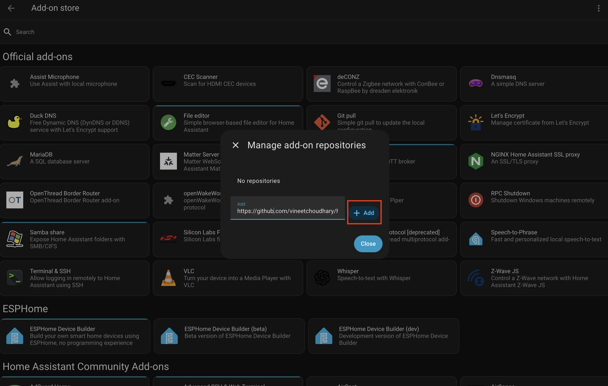
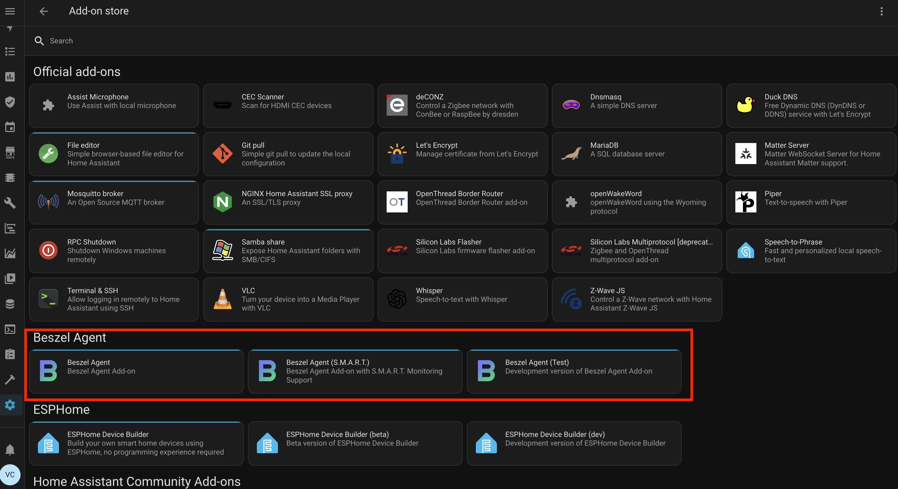
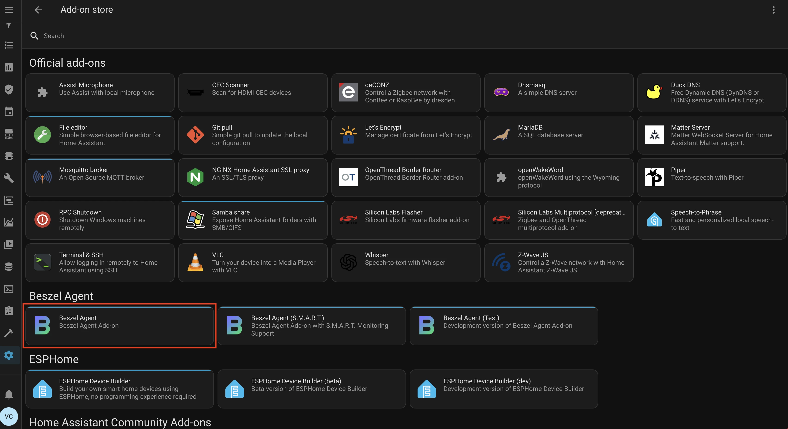
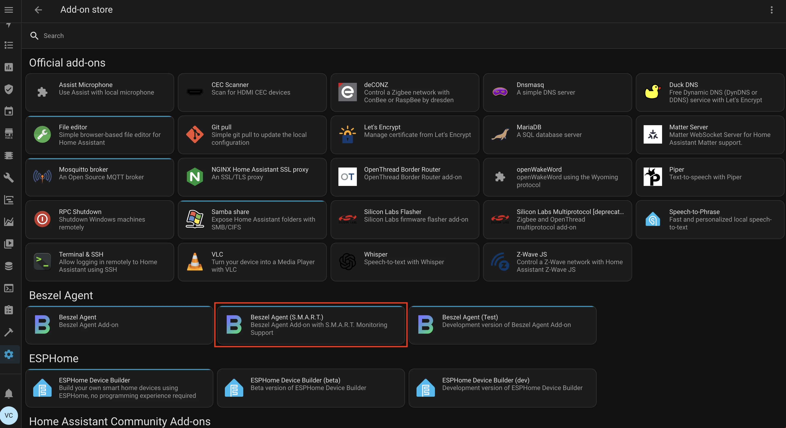
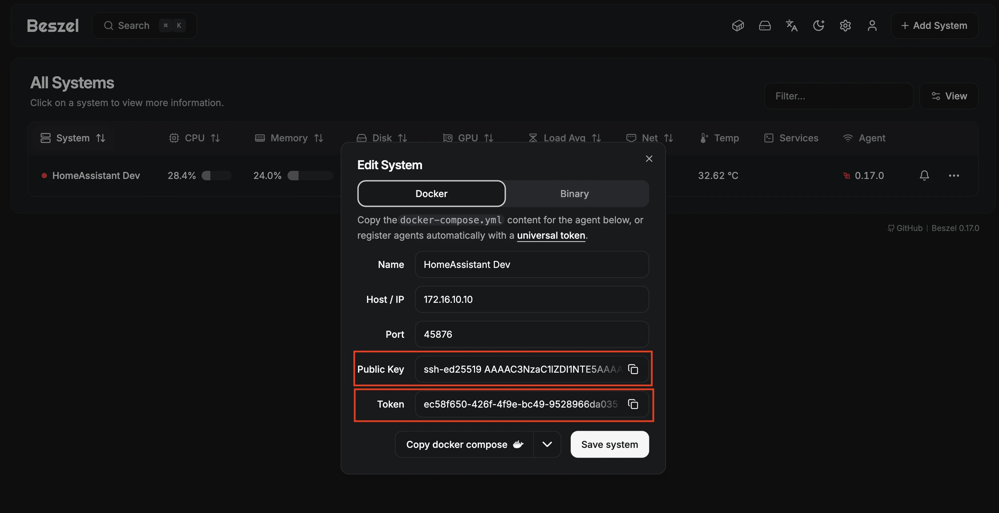
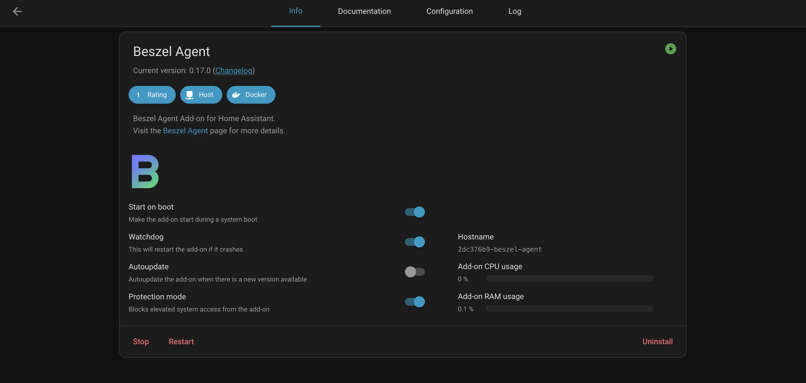
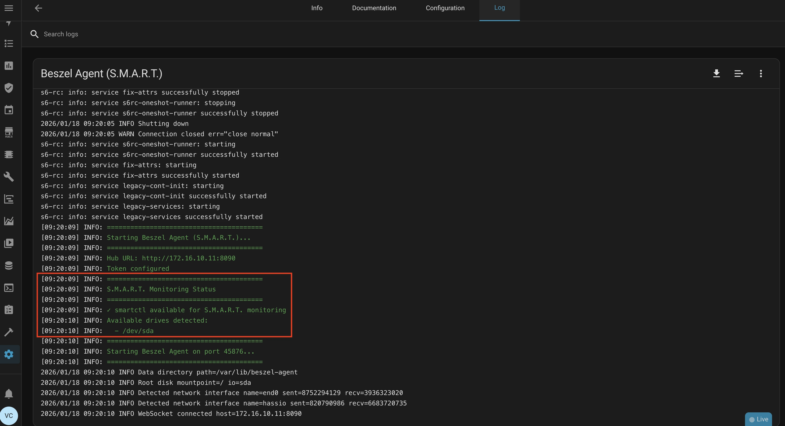
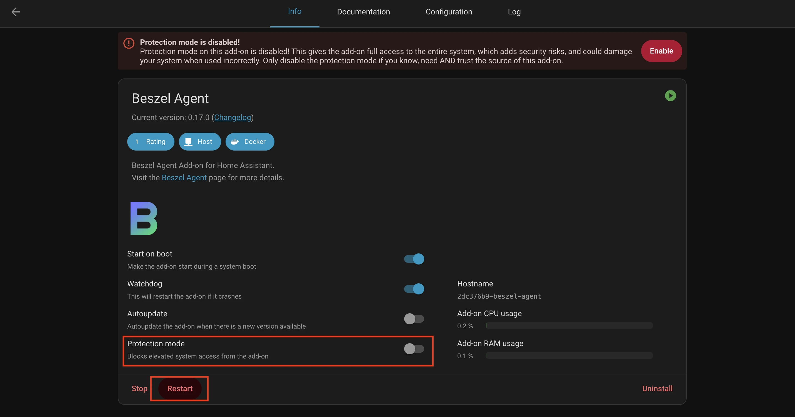
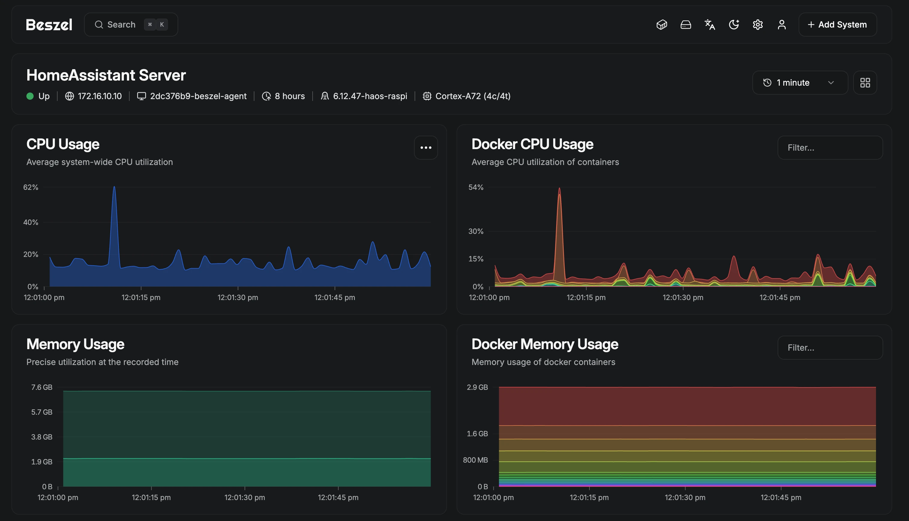
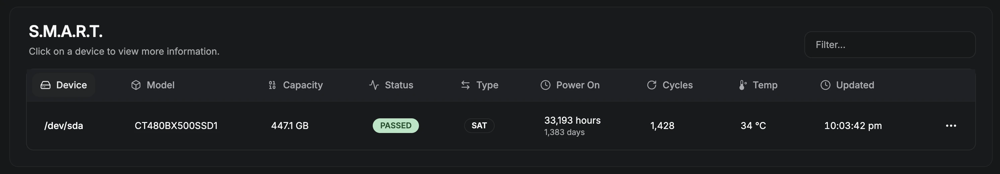

# Beszel Agent Add-on Installation & Setup Guide

This guide walks you through installing and configuring the Beszel Agent add-on for Home Assistant, using step-by-step screenshots.

---

## 1. Open Home Assistant Add-ons
Open your Home Assistant instance and navigate to Settings. Click on "Add-ons":


---

## 2. Open Add-ons Store
Click on "Add-on Store" button on bottom right:


---

## 3. Open Add-ons Store Repositories
Click on the three dots in the top right and select "Repositories":


---

## 4. Add Custom Repository
Paste following URL and click "Add" button:
```
https://github.com/vineetchoudhary/home-assistant-beszel-agent
```



---

## 5. Confirm Repository Added
You should see the Beszel Agent repository listed:


This repository provides three add-on variants (setup process is same for all variants):

### 5.1 Beszel Agent
For standard monitoring



### 5.2 Beszel Agent (S.M.A.R.T.)
For monitoring with S.M.A.R.T. disk health checks.



### 5.3 Beszel Agent (Test)
Development/testing version

---

## 6. Install Beszel Agent Add-on
Click on the "Beszel Agent" add-on you want to install and then click "Install":


---

## 7. Open Add-on Configuration
After installation, open the configuration tab:


---

## 8. Fill in Required Configuration

**key** - SSH public key

Grab this from your Beszel Hub when you're adding a new system to monitor.

```yaml
key: "ssh-ed25519 AAAAC3NzaC1lZDI1NTE5AAAAIExample..."
```

**hub_url** - Beszel Hub URL

Where your Beszel Hub is running.

```yaml
hub_url: "http://192.168.1.100:8090"
```

**token** - Authentication token

Grab this from your Beszel Hub when you're adding a new system to monitor.

```yaml
token: "your-secret-token"
```

Beszel Hub:



Enter your SSH key, Hub URL, and Token:


---

## 9. (Optional) Configure Custom Enviromnent Variables and Volumes

If you want to add custom environment variables and volume mappings you can do that here. 

**environment_vars** - Extra environment variables

Need to pass custom environment variables? Add them here:

```yaml
environment_vars:
  - name: "LOG_LEVEL"
    value: "debug"
  - name: SMART_DEVICES
    value: "/dev/nvme0:nvme,/dev/sda:sat"
```

Check available beszel agent environment variables [here](https://www.beszel.dev/guide/environment-variables#agent).

**custom_volumes** - Mount additional paths

```yaml
custom_volumes:
  - host_path: "/mnt/data"
    container_path: "/mnt/data:ro"
```

Add `:ro` for read-only, `:rw` (or nothing) for read-write.


---

## 10. Start the Add-on
Navigate back to the "Info" tab and click "Start":


---

## 11. Observe Add-on Running
You should see the add-on running successfully (You can check the logs for connection status).


For S.M.A.R.T. monitoring, addon logs will show detected disks:



---

## 12. (Optional) Disable Protection Mode
If you are not seeing expected metrics, try disabling protection mode. This is mostly required for other Add-ons stats (docker stats) and S.M.A.R.T. monitoring.


Protection Mode restricts add-on access to the host system. It's a security feature, but it limits what metrics Beszel can collect. Only disable it if you trust the add-on and beszel agent - it's open source, but disabling protection does give it broader system access.

---

## 13. Verify Metrics in Beszel Hub
Log in to your Beszel Hub instance and verify that metrics from your Home Assistant instance are being received:


For S.M.A.R.T. monitoring, you should see disk health metrics:


---

## Troubleshooting & Support
- If you encounter issues, check the add-on logs for errors.
- For advanced configuration, see the main documentation or open an issue on GitHub.

---

**Enjoy monitoring your Home Assistant system with Beszel Agent!**
