# Beszel Add-ons Installation & Setup Guide

This guide walks you through installing and configuring the Beszel add-ons for Home Assistant. The screenshots focus on the Agent add-ons, but the repository also includes Beszel Hub add-ons.

## 1. Open Home Assistant Add-ons
Open your Home Assistant instance and navigate to Settings. Click on "Add-ons":
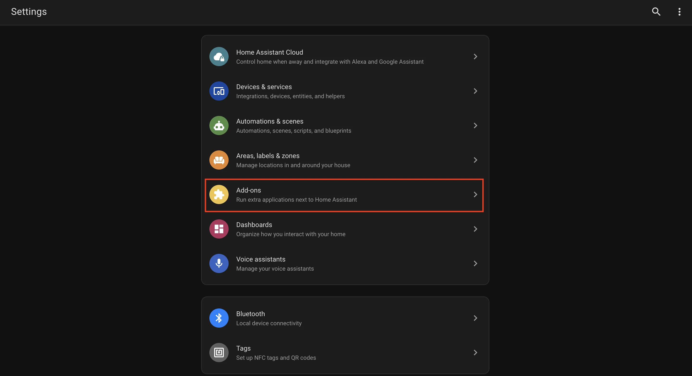

## 2. Open Add-ons Store
Click on "Add-on Store" button on bottom right:
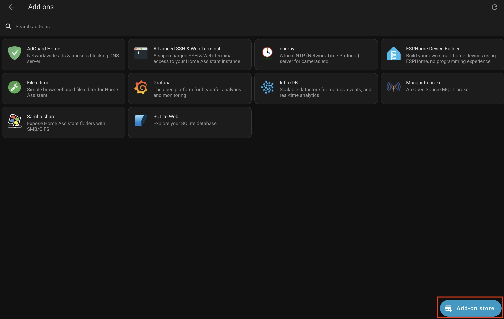

## 3. Open Add-ons Store Repositories
Click on the three dots in the top right and select "Repositories":
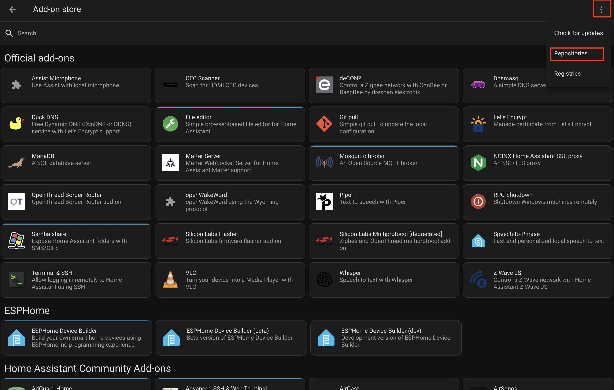

## 4. Add Custom Repository
Paste following URL and click "Add" button:
```
https://github.com/vineetchoudhary/home-assistant-beszel-agent
```

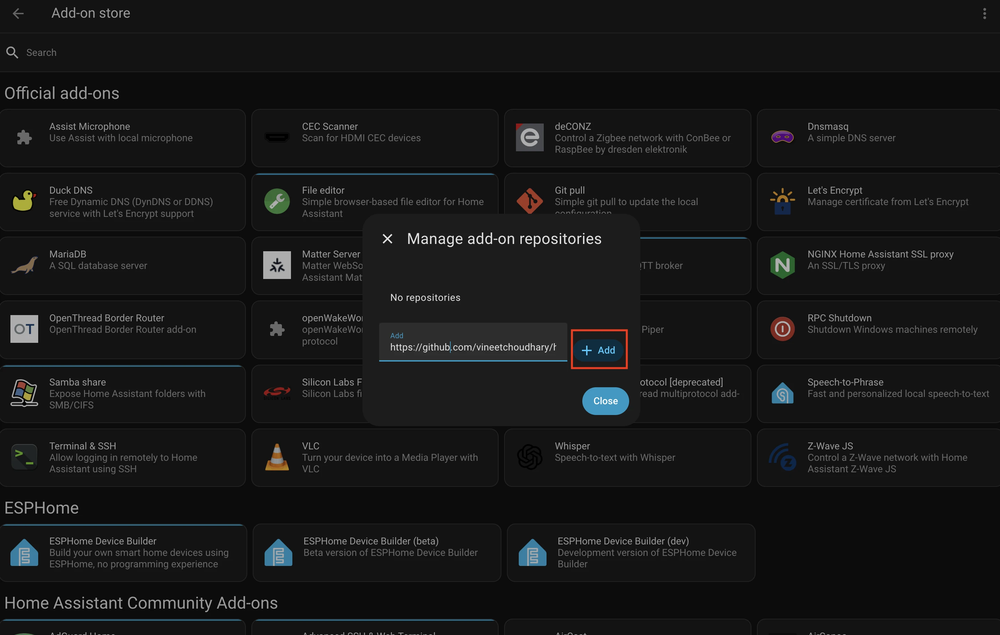

## 5. Confirm Repository Added
You should see the Beszel add-on repository listed:
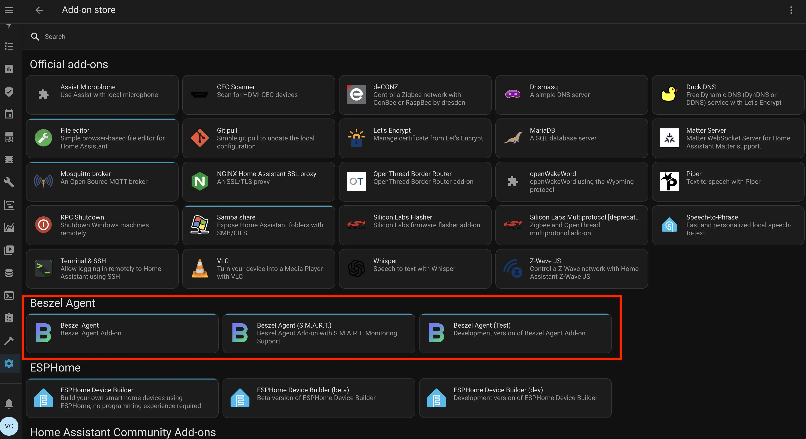

This repository provides six add-ons:

### 5.1 Beszel Hub
Run the Beszel Hub directly inside Home Assistant for smaller or self-contained setups.

### 5.2 Beszel Agent
For standard monitoring

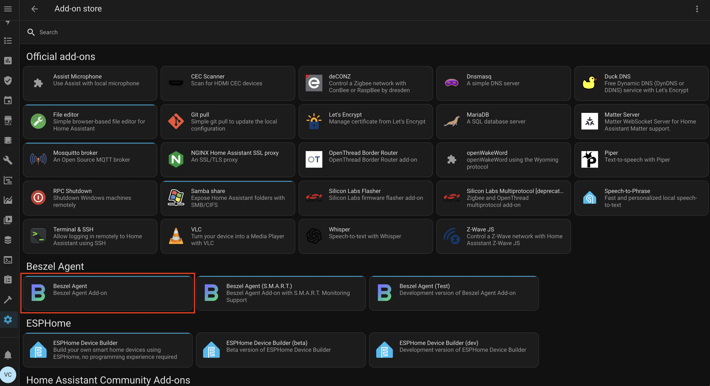

### 5.3 Beszel Agent (S.M.A.R.T.)
For monitoring with S.M.A.R.T. disk health checks.

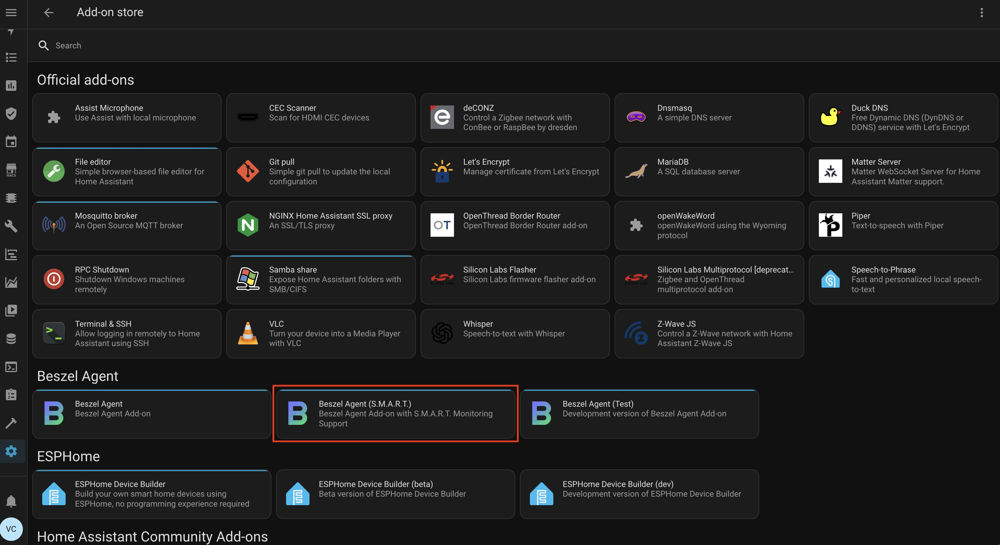

### 5.4 Beszel Agent (Intel GPU)
Intel GPU metrics plus S.M.A.R.T. disk health. amd64 only - the `intel_gpu_top` tool it needs is not packaged for aarch64.

### 5.5 Beszel Agent (AMD GPU)
AMD GPU metrics plus S.M.A.R.T. disk health. Reads GPU stats from sysfs, so no vendor tooling is required.

### 5.6 Beszel Agent (NVIDIA GPU)
NVIDIA GPU metrics plus S.M.A.R.T. disk health. **Read [its documentation](../beszel_agent_nvidia/DOCS.md) before installing** - Home Assistant add-ons cannot attach an NVIDIA GPU, so the GPU half only works on a Supervised host that has been configured with the NVIDIA runtime as Docker's default. Everything else in the add-on works regardless.

## 6. Install a Beszel Add-on
Click on the Beszel add-on you want to install and then click "Install":
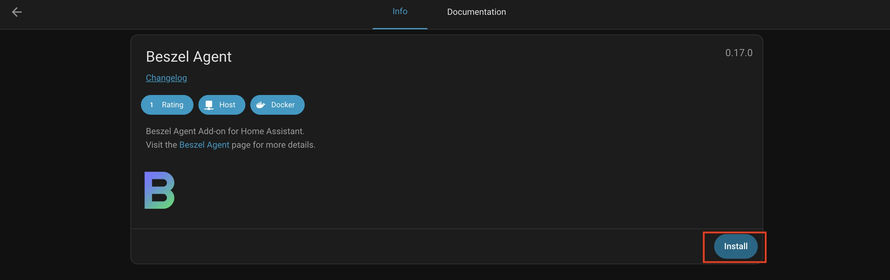


## 7. Open Add-on Configuration
After installation, open the configuration tab:
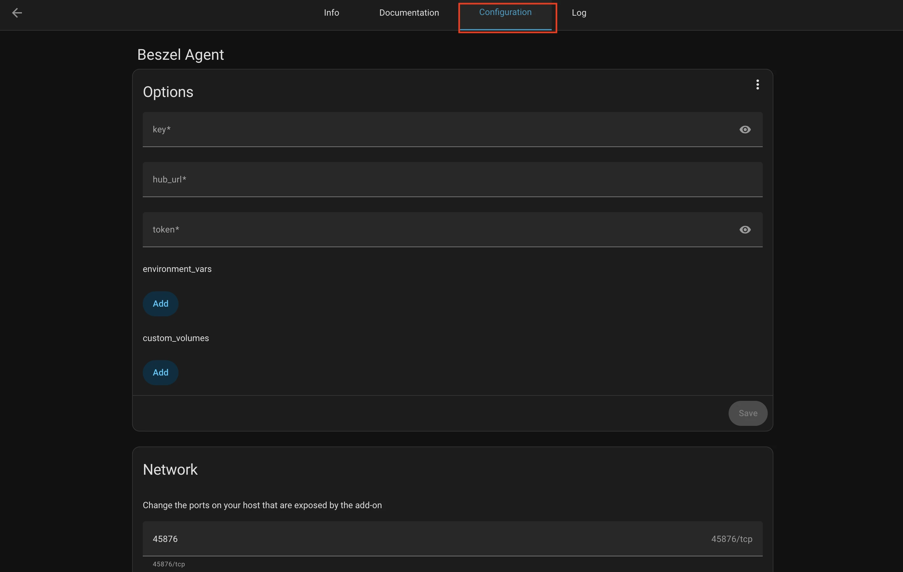

## 8. Fill in Required Configuration

If you are installing `Beszel Hub`, you can leave the configuration empty and start the add-on right away. After it starts, open `http://<home-assistant-host>:8090` and create the first admin user.

The optional `app_url` setting is the public URL of your Hub - Beszel uses it for the links it puts in alert emails, so set it if you use notifications. Careful with paths: `https://example.com/beszel` makes the Hub serve everything under `/beszel/`, and plain `http://<home-assistant-host>:8090/` stops working. See [Beszel Hub - Setup and Configuration](../beszel_hub/DOCS.md) for the details.

For Agent add-ons, fill in the values below.

**key** - SSH public key

Grab this from your Beszel Hub when you're adding a new system to monitor.

```yaml
key: "ssh-ed25519 AAAAC3NzaC1lZDI1NTE5AAAAIExample..."
```

**hub_url** - Beszel Hub URL

Where your Beszel Hub is running.

```yaml
hub_url: "http://192.168.1.100:8090"
```

**token** - Authentication token

Grab this from your Beszel Hub when you're adding a new system to monitor.

```yaml
token: "your-secret-token"
```

Beszel Hub:

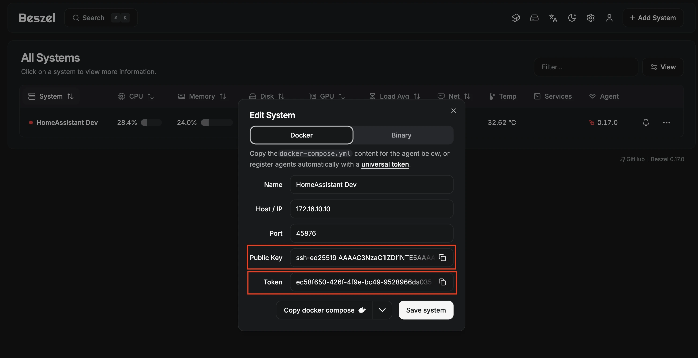

Enter your SSH key, Hub URL, and Token:

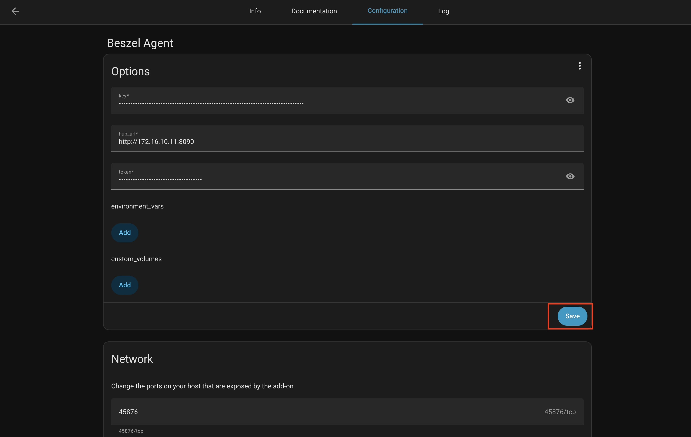

## 9. (Optional) Configure Custom Environment Variables and Volumes

If you want to add custom environment variables and volume mappings you can do that here. 

**environment_vars** - Extra environment variables

Need to pass custom environment variables? Add them here:

```yaml
environment_vars:
  - name: "LOG_LEVEL"
    value: "debug"
  - name: SMART_DEVICES
    value: "/dev/nvme0:nvme,/dev/sda:sat"
```

Check available beszel agent environment variables [here](https://www.beszel.dev/guide/environment-variables#agent).

**custom_volumes** - Check that a path is visible to the add-on

```yaml
custom_volumes:
  - host_path: "/mnt/data"
    container_path: "/mnt/data:ro"
```

> **This option does not mount anything.** Home Assistant builds an add-on's
> mounts from the add-on's own `config.yaml`, and it does not allow an add-on to
> mount an arbitrary host path chosen from its options. The entries here are only
> checked for existence inside the add-on and reported in the log, which is useful
> for confirming a path Home Assistant already shares. If the log says a path is
> not present, no setting in this add-on can make it appear.

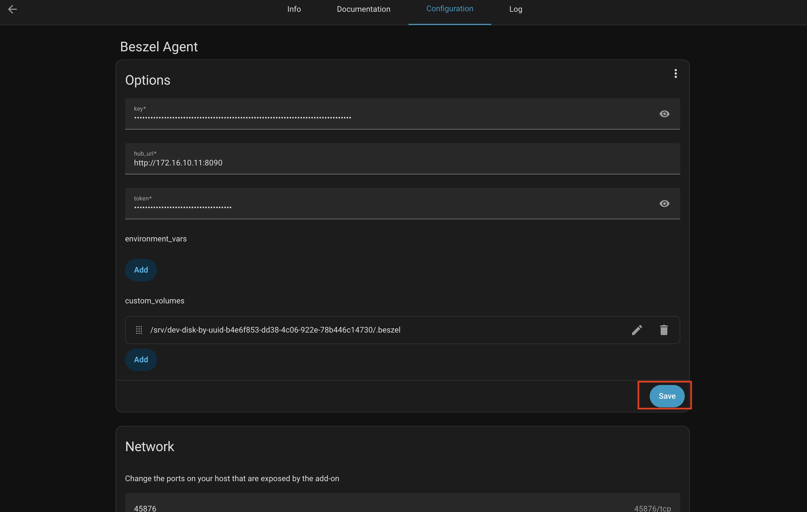

## 10. Start the Add-on
Navigate back to the "Info" tab and click "Start":
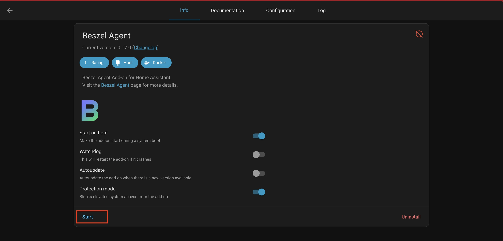

## 11. Observe Add-on Running
You should see the add-on running successfully (You can check the logs for connection status).
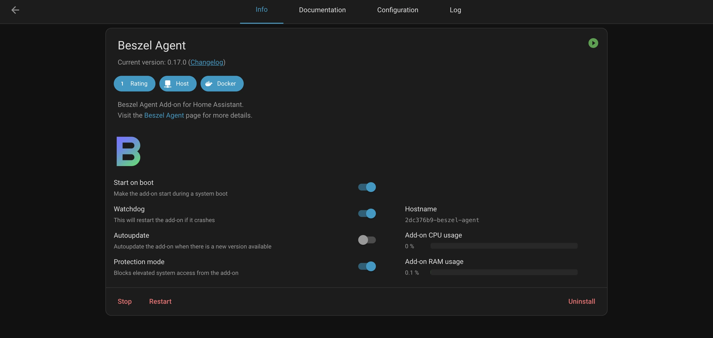

For S.M.A.R.T. monitoring, addon logs will show detected disks:

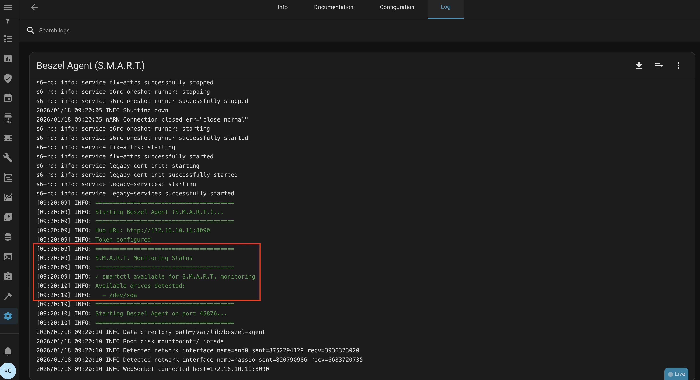

The Agent add-ons use two internal ports:

- `45876` for the Beszel agent connection from your Beszel Hub
- `45877` for the internal Home Assistant watchdog healthcheck endpoint

The Beszel Hub add-ons use:

- `8090` for the Beszel web UI and API

## 12. (Optional) Disable Protection Mode
If you are not seeing expected metrics, try disabling protection mode. It is required for other Add-ons stats (docker stats), S.M.A.R.T. monitoring on every variant, and Intel Arc/Xe GPUs. Plain GPU device access does not need it - Home Assistant applies the `/dev/dri` device rules either way - but `full_access` and host PID access are only granted to an unprotected add-on.
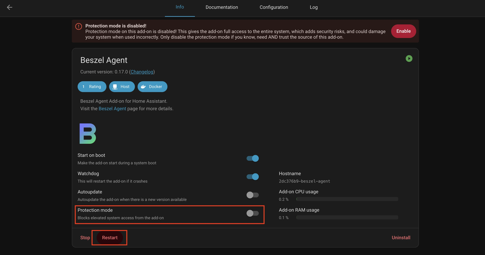

Protection Mode restricts add-on access to the host system. It's a security feature, but it limits what metrics Beszel can collect. Only disable it if you trust the add-on and beszel agent - it's open source, but disabling protection does give it broader system access.

## 13. Verify Metrics in Beszel Hub
Log in to your Beszel Hub instance and verify that metrics from your Home Assistant instance are being received:
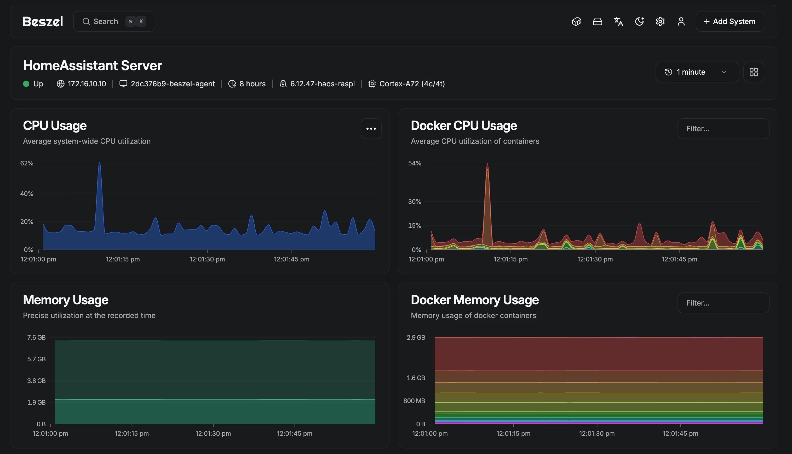

For S.M.A.R.T. monitoring, you should see disk health metrics:
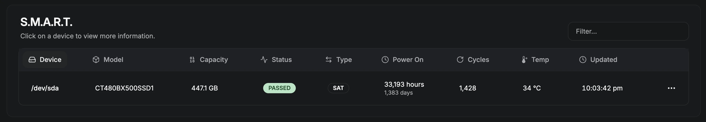

## Troubleshooting & Support
- If you encounter issues, check the add-on logs for errors.
- If Home Assistant reports watchdog failures, check whether the logs mention the HTTP health endpoint on port `45877`.
- For advanced configuration, see the main documentation or open an issue on GitHub.

**Enjoy monitoring your Home Assistant system with Beszel!**
